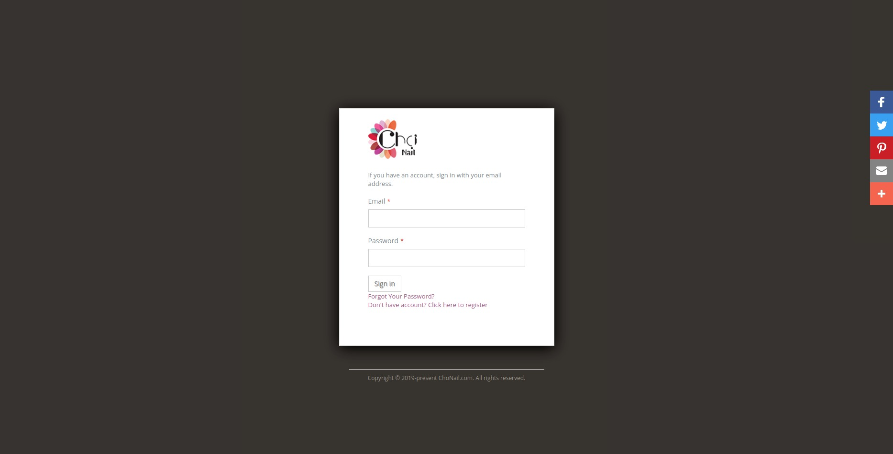
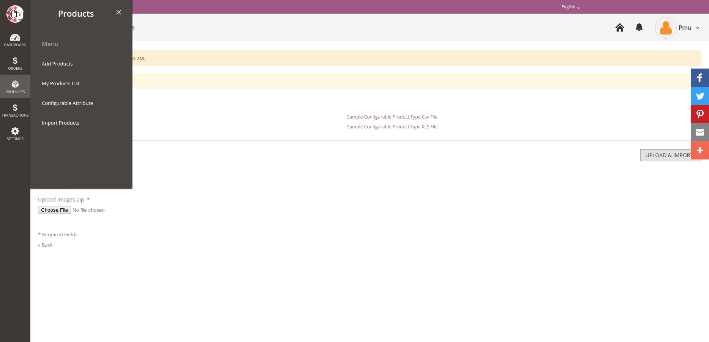
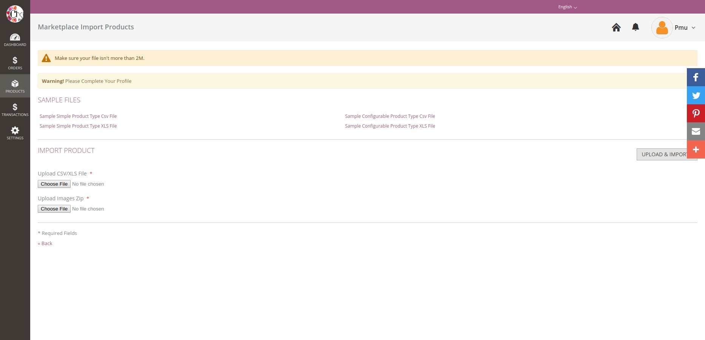
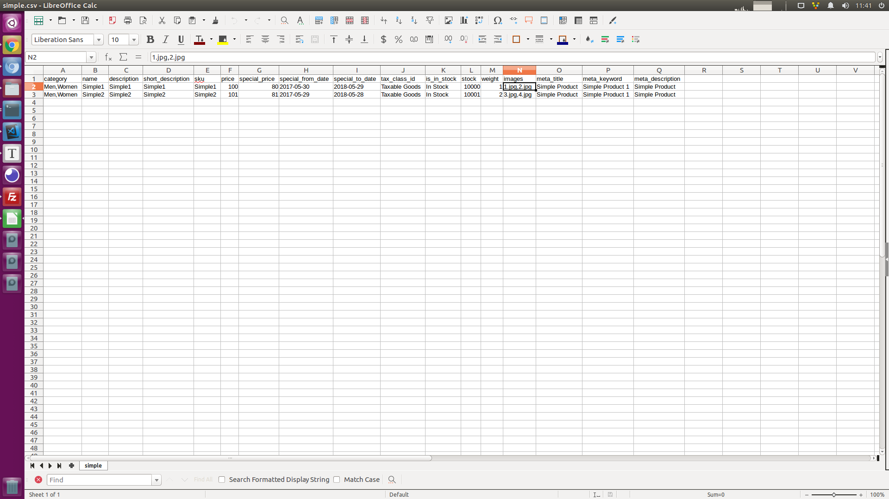
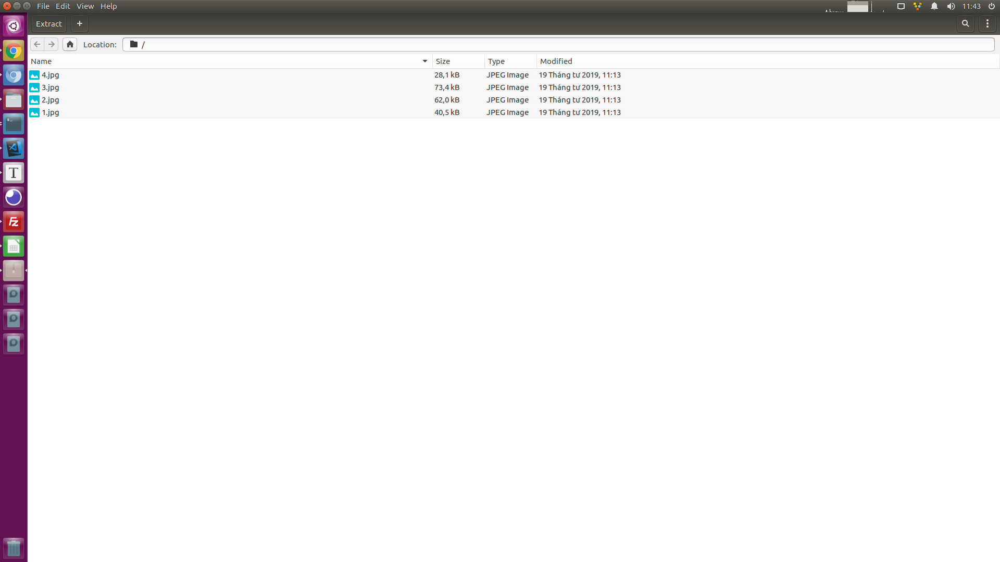
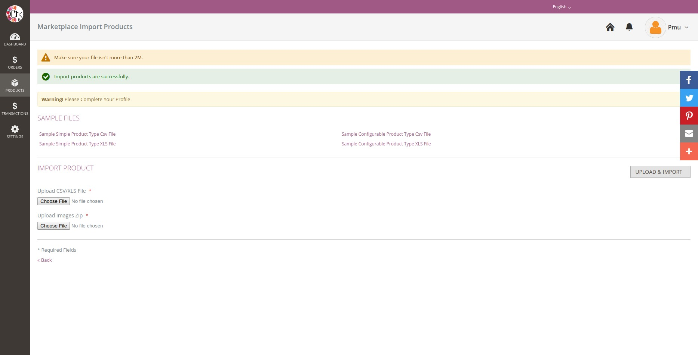
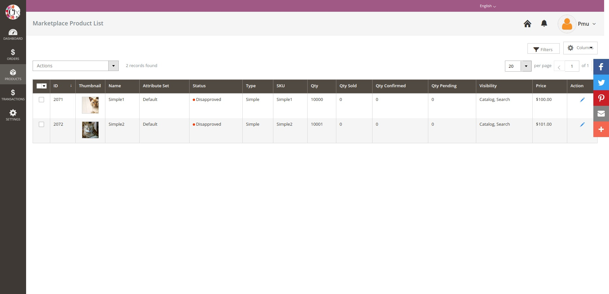

## Magento 2 Import Product for Seller in Marketplace Module


### Require

```
composer require phpoffice/phpspreadsheet
php bin/magento setup:upgrade
php bin/magento cache:flush
```

## How to use Import Products Module for Marketplace

### 1. Login Marketplace Vendor Login

URL: [Marketplace Vendor Login](https://magento.local/marketplace/account/login/)



### 2. Menu: Products > Import Products



### 3. Download sample files



### 4. Preparation csv/xls data and images zip before import

Map column **images** and file name images in .zip file

- CSV/XLS file

  

- Images zip

  

### 5. Import

Select csv file and images zip file and Click **Upload and Import**



- Check Products list



